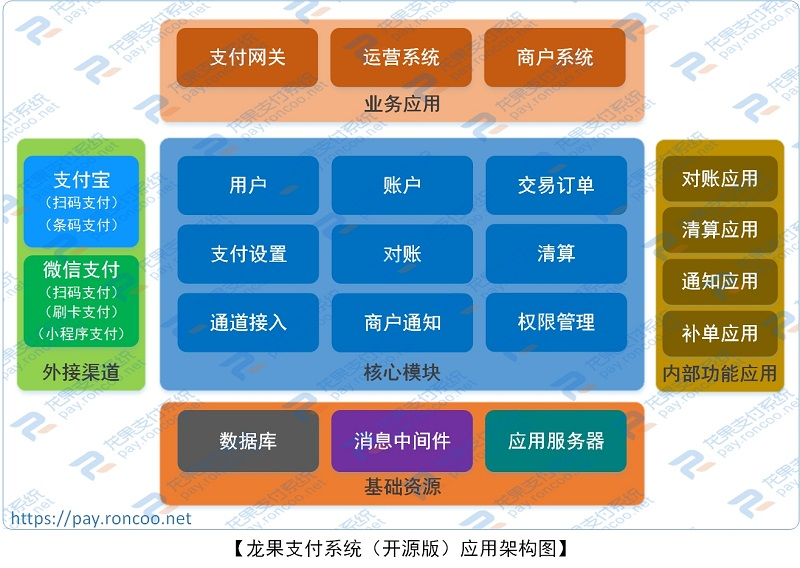
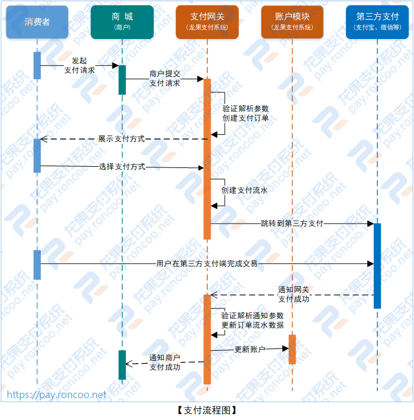

 

# 龙果支付系统 roncoo-pay

龙果支付系统（roncoo-pay）是国内首款开源的互联网支付系统，拥有独立的账户体系、用户体系、支付接入体系、支付交易体系、对账清结算体系。目标是打造一款集成主流支付方式且轻量易用的支付收款系统，满足互联网业务系统打通支付通道实现支付收款和业务资金管理等功能。

###### 主要特点：

1. 具备支付系统通用的支付、对账、清算、资金账户管理、支付订单管理等功能；

2. 目前已接通“支付宝扫码支付”和“微信扫码支付”通道；

3. 支持直连和间连两种支付模式，任君选择；

4. 通过支付网关，业务系统可以轻松实现统一支付接入；

5. 搭配运营后台，支付数据的监控和管理可以兼得；

6. 配套完善的系统使用文档，可轻松嵌入任何需要支付的场景；

7. 龙果支付系统产品技术团队是一支拥有多年互联网支付系统设计研发经验的团队，会为龙果支付系统持续提供免费开源技术服务支持。

----------------------------------------------------------------------------------

###### 应用架构：


###### 支付流程：


----------------------------------------------------------------------------------

##### 技术框架
| 技术 | 描述|
|---|--- |
| [Spring Boot](https://spring.io/projects/spring-boot) | 核心框架 |
| [Apache Shiro](http://shiro.apache.org)  | 安全框架 |
| [MyBatis](http://www.mybatis.org/mybatis-3/zh/index.html) | ORM框架 |
| [Druid](https://github.com/alibaba/druid/wiki/%E5%B8%B8%E8%A7%81%E9%97%AE%E9%A2%98) | 数据连接池 |
| [Redis](https://redis.io) | 缓存数据库 |
| [Ehcache](http://www.ehcache.org/) | 进程内缓存框架 |
| [Maven](http://maven.apache.org/) | 项目管理 |

##### 项目结构
```
roncoo-pay //龙果支付
|
├── roncoo-pay-app-notify //商户通知模块
|
├── roncoo-pay-app-order-polling //订单轮询模块
|
├── roncoo-pay-app-reconciliation //交易对账模块
|
├── roncoo-pay-app-settlement //交易结算模块
|
├── roncoo-pay-common-core //公共基础模块，不需要单独部署
|
├── roncoo-pay-service //核心业务模块，不需要单独部署
|
├── roncoo-pay-web-boss //运营后台模块
|
├── roncoo-pay-web-gateway //支付网关模块
|
├── roncoo-pay-web-merchant //商户后台模块
|
├── roncoo-pay-web-sample-shop //模拟商城模块
```

##### 模块介绍
> roncoo-pay-app-notify

说明：商户通知模块，把交易成功的订单信息按一定的通知策略通知相应的商户

> roncoo-pay-app-order-polling

说明：订单轮询模块，按制定的查询策略对平台支付中的订单进行结果查询，然后对获取到的订单结果做相应的处理（注意：除了轮询还能通过异步通知获取订单结果进行处理）

> roncoo-pay-app-reconciliation

说明：交易对账模块，每天定时对前一天平台的交易订单和银行方（例如：微信、支付宝...）订单进行匹配校验，校验订单状态、手续费、交易金额等

> roncoo-pay-app-settlement

说明：交易结算模块，每天定时对前一天已对完账后确认无误的交易订单进行结算，把钱结算给对应的商家和平台

> roncoo-pay-common-core

说明：公共基础模块，包含公共的工具类、枚举、配置、基础实体、基础DAO层等

> roncoo-pay-service

说明：核心业务模块，整个系统的核心，所有业务功能（下单，查询、账户操作......）的实现，所有web工程和app服务都需要引用该模块

> roncoo-pay-web-boss

说明：运营后台模块，提供对支付系统功能的配置和维护，例如维护银行信息、支付产品，商户信息、费率、交易查询等

> roncoo-pay-web-gateway

说明：支付网关模块，对商家提供对外的网关支付接口（包含支付下单，支付查询......）

> roncoo-pay-web-merchant

说明：商户后台模块，提供商户查看交易订单信息

> roncoo-pay-web-sample-shop

说明：模拟商城模块，提供向支付系统发起支付请求的商城，提供测试方法

---------

在线支付演示：http://demo.pay.roncoo.com

后台运营管理：http://demo.pay.roncoo.com/boss

系统操作说明：https://blog.roncoo.com/article/124375

系统详细介绍：https://blog.roncoo.com/article/124373

系统搭建部署：https://blog.roncoo.com/article/124511

###### 欢迎加群
QQ2群：597865269   

QQ1群：287684257(已满) 

欢迎加群，共同探讨互联网支付行业的技术经验！

龙果支付系统官网：http://pay.roncoo.net

 


 


